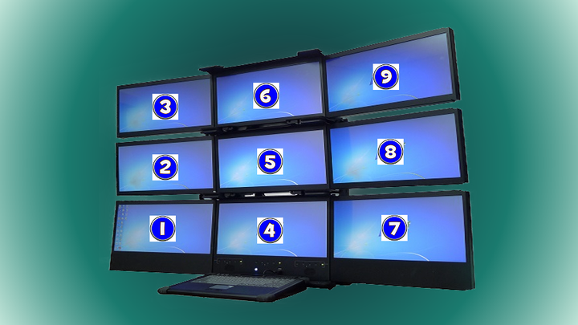

# 利用 AutoHotKey 实现 win10 多显示器（扩展模式）快速切换


## 前言

在日常办公中我们经常会使用到外接多个显示屏来辅佐我们 提高办公效率

然而多显示屏每次切换屏幕都要用鼠标来移动切换, 对鼠标的依赖非常重且非常麻烦😵

而且 Windows 系统自带 **WIN + Shift + 方向左右** 快捷键，虽然可以将活动窗口移动到其它屏幕

**可是，窗口过去了，光标还在原地……  属实鸡肋**


## MoveMouseToMonitor

经过一番搜寻, 从知乎提问的问题 [请问win10接双显示器（扩展模式）怎么把鼠标游标切换到第二台显示器上？](https://www.zhihu.com/question/50002939/answer/2482798775) 中的一个回答找到了答案, 以下内容借用一下知乎答主的回答


一位叫做 Joe Winograd 的作者, 基于 AutoHotKey 做了个 MoveMouseToMonitor 脚本。简单来讲，就是让你的键盘教你的鼠标做事，**通过 Alt + Ctrl + 数字键，将光标直接移动到对应屏幕**，如下图所示：



例如，**想操作图中屏幕2，只要按下 Alt + Ctrl + 2 ，光标立刻跳转到屏幕2的中心**。


## END

感谢原作者提供的 **MoveMouseToMonitor** 脚本与上面提到的这位知乎答主的回答

该版本顺带修复了原答主版本中, 鼠标光标移动后, 键盘输入的聚焦没跟随鼠标聚焦移动的问题

如果对你有用, 请点个Star✨吧

具体修改如下👇


## 修改

当执行完 **PerformMove** 函数成功移动鼠标后

创建一个 **ActivateWindowByMousePosition** 函数,  获取当前鼠标位置的窗口 `title`

`WinActivate` 会根据鼠标窗口的`title` 来激活目标窗口, 把键盘的聚焦也激活, 从而真正实现切换并激活窗口, 达到键鼠聚焦同步👍

```autohotkey
PerformMove(MoveMonNum, OffX, OffY)
{
    global MoveX, MoveY
    Gosub, CheckNumMonsChanged
    RestoreDPI := DllCall("SetThreadDpiAwarenessContext", "ptr", -3, "ptr")
    SysGet, Coordinates%MoveMonNum%, Monitor, %MoveMonNum%
    Left := Coordinates%MoveMonNum%Left
    Right := Coordinates%MoveMonNum%Right
    Top := Coordinates%MoveMonNum%Top
    Bottom := Coordinates%MoveMonNum%Bottom
    If (OffX = -1)
        MoveX := Left + (Floor(0.5 * (Right - Left)))
    Else
        MoveX := Left + OffX
    If (OffY = -1)
        MoveY := Top + (Floor(0.5 * (Bottom - Top)))
    Else
        MoveY := Top + OffY
    DllCall("SetCursorPos", "int", MoveX, "int", MoveY)
    Sleep, 10
    DllCall("SetCursorPos", "int", MoveX, "int", MoveY)
    DllCall("SetThreadDpiAwarenessContext", "ptr", RestoreDPI, "ptr")

    Gosub, ActivateWindowByMousePosition

    Return
}

ActivateWindowByMousePosition:
    MouseGetPos, , , id, control
    WinGetTitle, title, ahk_id %id%
    WinActivate, %title%
    Return

```


## AutoHotKey工具

[AutoHotKey 1.1 下载地址](https://www.autohotkey.com/download/ahk-install.exe)

安装完成后打开 **Ahk2Exe.exe** 程序, 把修改好的**MoveMouseToMonitor.ah**文件直接打包即可